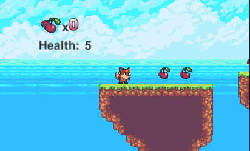

# 2D-Platformer
A 2D Platformer game using the Unity Engine

The goal of the game is to get to the end of each level until the character reaches home. The game has monsters, a health bar, levels, items and power ups. I have used object pooling, animations and physics to create the basis of my game.

## demo ##

